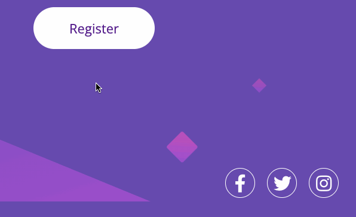

# Huddle landing page with a single introductory section
### Este projeto é baseado no [Frontend Mentor]( https://www.frontendmentor.io/challenges/huddle-landing-page-with-a-single-introductory-section-B_2Wvxgi0), um desafio e Quest do curso DevQuest, desenvolvido pelo Dev em Dobro.
### O Projeto foi realizado para tela de 1440px.

## Tecnologias:
- HTML
- CSS

## Interações
Os Botões Register e redes sociais são clicáveis e mudam a cor de forma suave.

# Responsividades

- Tablet 768px

- Mobile 375px
 